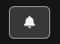
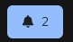
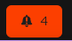
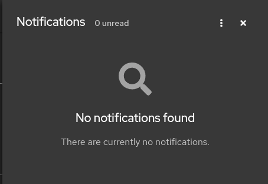
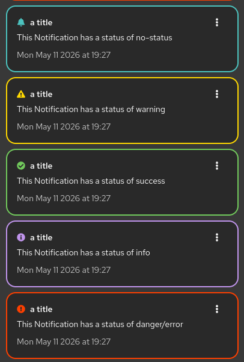
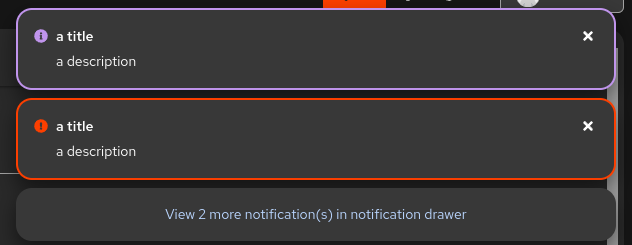

The UI has the ability to receive notifications.

## Notification Badge

The "Notification Badge" is in the right half of the page header bar. Clicking on it will **open the [Notification Drawer](#notification-drawer)**

_Figure: Notification Badge when there are no unread notifications._

The Notification Badge will show a total of any unread notifications. In addition, it will change colour showing that there is unread notifications.

_Figure: Notification Badge formatted when there are unread notifications. Total unread notifications are also shown._

_Figure: Notification Badge formatting when there is at least one Error. Total unread notifications are also shown._

!!! info Developer Information

    - [API Docs](../api/HeaderToolbar/index.md)

## Notification Drawer

All notifications can be viewed from within the Notification Drawer.

_Figure: Open Notification Drawer with no notifications._

Each individual notification as well as the Notification Drawer have a `Hamburger Icon` / `Action Menu` that you can click on to mark as read or clear the notification(s).

_Figure: Open Notification Drawer with each of the types of available notification status'._

!!! info Developer Information

    - [API Docs](../api/Notifications/index.md)

    - To create a notification use function `addNewNotification` from the [useNotificationActions](../api/useNotificationActions/index.md) hook.

## Alerts

Notifications can also be shown as alerts. The difference between an "Alert" and a "Notification" is that an alert will display initially as a pop-up in the upper right hand side of your screen. After the auto-timeout or if you dismiss the alert, it can be viewed in the [Notification Drawer](#notification-drawer).

_Figure: What alerts look like when displayed. Note that if too many alerts display, as overflow message will display (the gray box), letting you knwow how many more alerts have arrived._

!!! info Developer Information

    - Alerts shares the same API as the [Notification Drawer](#notification-drawer).

    - To create an alert set parameter `isAlert = true` when calling function `addNewNotification`.
